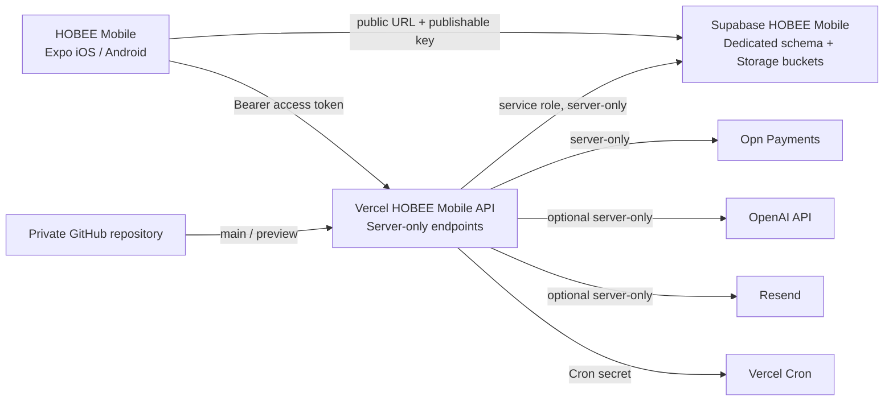

# HOBEE Mobile — Migration Gap Matrix and Target Architecture

## Target architecture

The target removes managed Manus runtime dependencies from production request paths. Expo remains a client application, while privileged payment, webhook, storage-administration, AI, email, and cron work stays behind server-only Vercel functions. The client receives only public Supabase configuration and never receives privileged credentials.

## Migration gap matrix

| Area | Current state | Target state | Required change | Gate | Owner |
|---|---|---|---|---|---|
| Source control | GitHub repository exists and is synchronized | One private repository remains the source of truth | Confirm repository privacy and branch protection | Source ready | Tech owner |
| Mobile Supabase client | Provider-direct public URL/key and persisted session storage | Retain | Keep only `EXPO_PUBLIC_SUPABASE_URL` and `EXPO_PUBLIC_SUPABASE_PUBLISHABLE_KEY` in mobile build configuration | Runtime ready | Tech owner |
| Database isolation | Existing project/schema uses mixed historical scope | Dedicated approved HOBEE Mobile schema or documented technical exception | Owner decides target schema; write migration/row-count plan before data move | Database migrated | Data owner |
| Vercel backend | `vercel-backend/` source exists, not proven on intended owner team | Dedicated Vercel project with preview and production environments | Link private GitHub repository under the correct HOBEE team; configure server-only variables | Vercel ready | Cutover owner |
| Auth | Supabase password flows exist; older Manus OAuth/server glue remains in source | Supabase-only user session and authorization path | Remove/retire remaining OAuth/runtime glue only after mobile auth regression coverage passes | Functional ready | Tech owner |
| Storage | Mixed Supabase and Manus storage helpers | Supabase Storage buckets only | Inventory active `server/storage.ts` callers; replace each with bucket-scoped Supabase access | Functional ready | Tech owner |
| Payment | Vercel source has Opn adapter and webhooks; no verified deploy/test | Vercel server-only Opn integration | Configure Vercel secret variables and test with sandbox before enabling production charges | Functional ready | Payment owner |
| AI/voice | Manus Forge helpers remain | Direct OpenAI or intentionally disabled | Identify active feature calls; migrate only approved capabilities | Functional ready | Product/Tech owner |
| Email | No verified Resend delivery | Resend with verified sender/domain, or feature disabled | Add only if transactional email is in release scope | Notification ready | Business owner |
| Scheduler | Manus heartbeat/task integration remains | Vercel Cron guarded by `CRON_SECRET` | Inventory active jobs; make each idempotent and retire old scheduler only after test | Vercel ready | Tech owner |
| Maps | Native map capability exists | Direct Google Maps or disabled UI | Confirm provider and configure native build secrets outside source | Functional ready | Product owner |
| Domain | No migration domain/cutover owner recorded | Canonical Vercel production domain with rollback owner | Supply domain, DNS owner, canonical/redirect policy and monitoring window | Cutover ready | Domain owner |

## Validation gates

| Gate | Evidence required before approval | Current status |
|---|---|---|
| Source ready | Private GitHub repository, clean validation, secret-safe ignore rules | Conditional pass; production branch protection/privacy still requires owner confirmation |
| Database migrated | Target schema, foreign-key and row-count comparison, sampled records, storage inventory | Pending schema decision and data-owner signoff |
| Runtime ready | TypeScript, tests, provider-direct configuration, no active Manus fallback in production path | Pending runtime decoupling |
| Vercel ready | Intended team/project, preview deployment, `/api/health` with read-only Supabase check | Blocked by team access mismatch and secrets |
| Functional ready | Login, protected record operation, upload, payment sandbox or disabled state | Pending Vercel deployment and native QA |
| Notification ready | Resend verified sender/domain and one delivered test, if email is released | Pending / optional |
| Cutover ready | Canonical domain, DNS owner, rollback window, monitoring owner | Pending owner decisions |

## Rollback and cutover rules

No DNS or mobile production configuration may change until the Vercel production URL passes health, login, and core-flow validation. Keep the current deployment URL, the GitHub `main` commit, and the last validated checkpoint as rollback references. If a database or authentication validation fails, stop the write path and return traffic/configuration to the last accepted source; do not proceed simply because a build is successful.

## References

[1]: https://vercel.com/docs "Vercel Documentation — Deployments, Environment Variables and Cron Jobs"
[2]: https://supabase.com/docs "Supabase Documentation — PostgreSQL, Schemas and Storage"
[3]: https://platform.openai.com/docs "OpenAI API Documentation"
[4]: https://resend.com/docs "Resend Documentation — Domains and Email API"
